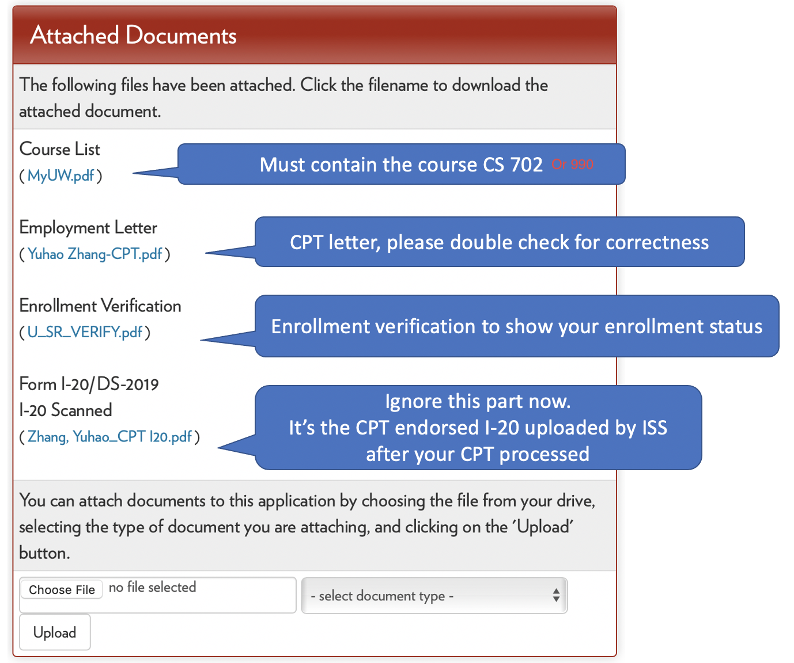

# How to request CPT in our department?

**Disclaimer:** This webpage describes the CPT process for the computer science department of the University of Wisconsin-Madison in 2020. ***Note that the CPT process may differ for different universities, departments, and times. If you are confused, please reach out to the ISS of your university and the program advisor of your department.*** If you find something wrong and misleading, please shoot me an email to get things fixed.

**Our ISS gives detailed steps about CPT processing steps [here](https://iss.wisc.edu/employment/f1-employment/f-1-curricular-practical-training-cpt/cpt-application-process/)**. The purpose of this article is to **add details specifically regarding the CS department.**

**What's CPT?** (copy from our [ISS website](https://iss.wisc.edu/employment/f1-employment/f-1-curricular-practical-training-cpt/))

[Curricular Practical Training (CPT)](https://studyinthestates.dhs.gov/sevis-help-hub/student-records/fm-student-employment/f-1-curricular-practical-training-cpt#general_information) is an employment authorization for F-1 students. Eligible students may seek authorization to work in an internship, co-op, or practicum that is directly related to your major field of study. The purpose of CPT is to apply the knowledge and skills you are gaining in the classroom to practical work experience in the U.S.

In short, if you are an international student with an F-1 visa and you want to intern (full-time or part-time) in the following semester, you will need to get a CPT.

## Overview of CPT Process

**[Repeated Twice] Our ISS gives detailed steps about CPT processing steps [here](https://iss.wisc.edu/employment/f1-employment/f-1-curricular-practical-training-cpt/cpt-application-process/)**. The purpose of this article is to **add details specifically regarding the CS department.**

Usually, Angela or someone will send an email ahead of time (usually in March for summer internships). Please read the email carefully because **the process can differ from year to year**. The process of part-time internships in Fall and Spring is similar to Summer, but one needs to pay more attention to the start and end date of work and the credits.

The CPT process involves six parties: you, your advisor, your program advisor (for the traditional program Angela Thorp, and for PMP Janna Boehm in 2020), enrollment, ISS, and HR in the company.

The duty of each party:

- **You**. You are the one who requests a CPT for work from ISS. You are the one who coordinates all parties to work. 
- **Your advisor**. You need to get the approval of your advisor to do the internship. And you will need to enroll in a course whose instructor is your advisor. *If you are a PhD student, please talk to your advisor before finding a job. They can disagree with your internship plan, or they will help you get one.*
- **Your program (career) advisor**. As I will talk about later, you will also need permission from your program advisor to fire a CPT application in Terra Dotta.
- **Enrollment**. Enrollment manages the course. Once they are informed that you need to enroll in the CPT course (CS 702 for masters and pre-dissertators or 990 for dissertators), they will create a section in the course. You need to enroll in the course before submitting your CPT application to Terra Dotta.
- **ISS**. [ISS](https://iss.wisc.edu) is the department issuing your CPT.
- **HR in the company**. You need to request the CPT letter from them. You will then upload the [CPT letter](https://iss.wisc.edu/employment/f1-employment/f-1-curricular-practical-training-cpt/cpt-information-for-employers/) alongside the CPT application.

##Detailed Steps

**[Repeated Thrice] Our ISS gives detailed steps about CPT processing steps [here](https://iss.wisc.edu/employment/f1-employment/f-1-curricular-practical-training-cpt/cpt-application-process/)**. The purpose of this article is to **add details specifically regarding the CS department.**

The words copied from ISS website are *italic*.

##### **Step 1: Secure an Offer for Practical Training** 

*Seek a position that is directly related to your degree program (the major and degree level that matches your I-20). You must be offered the position before you submit your CPT application. Important: remember that CPT applications require thorough review so **please select an employment start date that allows for ISS processing time**.* 

Parties involved: `you`, `your advisor`, and `HR`.

As I said, talk to your advisor before finding a job. When finalizing your offer, you may talk about pay rate, location, and most importantly, the start and end work dates. You need to be careful about the start date because you need **up to 21 days** from submitting your CPT application to ISS and getting the CPT. **You cannot start work without a CPT!** Also, you need to be careful about the start and end date because there are restrictions about [**time**](https://iss.wisc.edu/employment/f1-employment/f-1-curricular-practical-training-cpt/cpt-dates/) (differed for summer, spring, and fall)!

##### **Step 2: Obtain a job offer letter from your employer.** 

*ISS is required to report certain elements of your CPT employment offer in SEVIS. We have created [a template](https://iss.wisc.edu/employment/f1-employment/f-1-curricular-practical-training-cpt/cpt-information-for-employers/) for the information on our website to help them create this process.*

Parties involved: `you` and `HR`.

You need to ask for the CPT offer letter from your HR. It is usually different from an offer letter! Because ISS requires more detailed information in the CPT letter, please see the **template** carefully.
Notice that your HR may not be familiar with the process, so you need to send them the template and ask for a letter following the ISS guideline. When you get the CPT letter from your HR, please check twice about the name, address, etc.

HR can be imprudent! I used to get offer letters that misspelled my name, contained the wrong working address, and even the wrong title (I googled and found it was for another guy with the same name as mine)!

Also, make sure the position description must be directly related to the student’s major. Some companies use templates of a position description, which does not relate to CS major, for all the interns! Some of us got rejected once because of that last year! So be careful!

##### **Step 3: Send the job offer letter to the career advisor who will be authorizing your CPT.** 

*Your career advisor needs to be able to complete a verification for ISS and they need to see the letter you received in order to do so.*

Parties involved: `you` and `your program (career) advisor`.

You send your CPT letter to your program (career) advisor in this step. Usually, I will cc my advisor so that 1) the email can get attention because it's cc-ed with a faculty, and 2) your advisor can directly reply to this email to give consent.

##### **Step 4-6: Complete ISS CPT application in Terra Dotta.** 

*You will fill out the CPT application in [Terra Dotta](https://terradotta.wisc.edu/) for ISS. You must upload your employment letter and include your Career Advisor’s email in the verification portion of the form.*

***There are addtional descriptions on the ISS website. I did not paste them here, but I rewrote a CS department version here.***

Parties involved: `you` and `enrollment`.

Before approaching your Terra Dotta, there is still one thing to keep in mind: you will need a course for your internship, and the course is CS 702/990 for masters and non-dissertators or 990 for dissertators (I heard that it used to be CS 799/899).
There is a google form distributed in the email concerning CS 702/990 (you can try to search CS 702 in your mailbox). You need to submit the form to inform enrollment to add a section for you (and your advisor as an instructor). The process usually takes three business days. After you enroll in the course, you can start to prepare the CPT application in Terra Dotta. I will spend another section talking about the application.

*Please remember to submit complete and accurate information so your application can be approved in a timely manner.* 

*The earliest date to submit your CPT application form to ISS is the date that you enroll in your CPT course (unless your practical training is required by your degree program with no course enrollment). CPT applications should be submitted at least 15 business days before the requested CPT start date.* 

***Only completed CPT applications will be reviewed**. Incomplete CPT applications will be rejected and must be resubmitted once it has been properly completed. CPT applications that are resubmitted will be subject to the 15 business day processing.* 

##### **Step 7: Collect Your CPT I-20, Review & Sign**

You will receive an email from ISS when your I-20 with CPT authorization is available. Collect the I-20 via your preferred method and review page 2 for your CPT authorization details. 

Verify that the dates, part-time/full-time, and employer name and location are correct. You can only work for the employer and dates you are authorized.

Sign and date page 1 of your I-20 in blue ink if all of the information is correct. 

Your employer should ask to see your I-20 with CPT authorization to complete the new employee paperwork.

**Important: please keep your I-20 for your permanent records.**

## CPT Application on Terra Dotta

The CPT application is hidden in the links [here](https://terradotta.wisc.edu/index.cfm?FuseAction=Abroad.ViewLink&Parent_ID=61ADF84B-F9FD-D592-C1E9278EE7213EA1&Link_ID=62C95064-F12A-D9DE-D2931D4006A97438). Please search for the word "CPT". 

I will talk about some important parts in the CPT application.

**Attached Documents**

As you can see, the attached documents require the course list and enrollment verification. It is crucial for a part-time internship in Spring and Fall because you still need to be enrolled as a full student. The enrollment verification will check whether you have enrolled in enough credits. 

The details about how to get the course list and enrollment verification are provided in the CPT application. And I did not copy-paste them here.

**E-verification**

The processed application hides the E-verification section, so I cannot put a snapshot here. You need to send a verification (automatically sent by ISS) by filling in your program (career) advisor's name, email, etc. 

After the approval, you will get a check in the box. If not, then the verification request has not been approved. If you are urgent, you can push the program (career) advisor by sending them an email (and cc your advisor to make your email noticed).

Yuhao Zhang

Jan 30 2022
